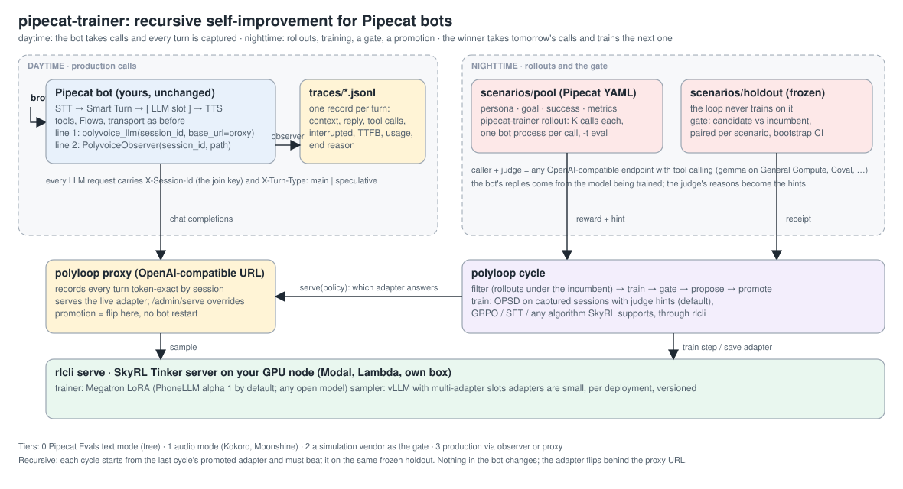
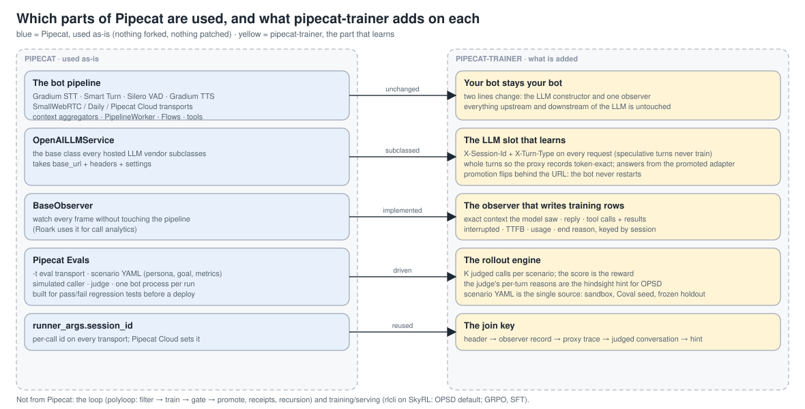

# pipecat-trainer

Recursive self-improvement (RSI) for Pipecat voice bots. The bot takes calls; every call becomes training
data; a loop trains the bot's LLM on those calls, gates the result on a held-out set, and promotes it; the
promoted model takes the next day's calls, which train the next one. Each cycle starts from the last
cycle's winner, so the bot improves from its own use, with a receipt at every step.

Two lines in your bot capture every call and let a trained adapter answer without a restart; Pipecat's own
eval scenarios become the rollout sandbox. Training is on-policy self-distillation (OPSD) by default, and
GRPO, SFT and the other algorithms [SkyRL](https://github.com/NovaSky-AI/SkyRL) supports, through
[rlcli](https://github.com/polygramme/rlcli).



The training loop is [polyloop](https://github.com/runnerelectrode/polyloop-rl) (cycle, gate, receipts) on
rlcli (training and serving); [polyvoice](https://github.com/polygramme/polyvoice) wires this package's
outputs into it. This repo is the Pipecat-facing half and depends only on `pipecat-ai`.

Starts from [pipecat-ai/phonellm-alpha-1](https://huggingface.co/pipecat-ai/phonellm-alpha-1) by default;
bot layout follows [pipecat-examples/phonellm](https://github.com/pipecat-ai/pipecat-examples/tree/main/phonellm).
Tested with pipecat-ai 1.11.0 (compatible with `>=1.9.0,<2`).

## Which parts of Pipecat, and what is added



| Pipecat, used as-is | How | pipecat-trainer adds |
|---|---|---|
| the bot pipeline: Gradium STT/TTS, Smart Turn, VAD, transports, aggregators, Flows, tools | unchanged | two lines: the LLM constructor and one observer |
| `OpenAILLMService`, the base class every hosted LLM vendor subclasses | subclassed | the LLM slot: session and turn-type headers, whole turns for token-exact capture, answers from the promoted adapter |
| `BaseObserver`, the frame-watching API | implemented | the observer that writes training rows (context, reply, tool calls, interruptions, latency, end reason) |
| Pipecat Evals: eval transport, scenario YAML, simulated caller, judge | driven as a rollout engine | K judged calls per scenario; score = reward, the judge's reasons = the hint; scenarios are the single source for sandbox, Coval and holdout |
| `runner_args.session_id` | reused | the join key from header to trace to judged conversation to hint |

Nothing in Pipecat is forked or patched. The loop itself (filter, train, gate, promote, receipts, recursion)
is polyloop, and training and serving are rlcli on SkyRL.

## Use it with Pipecat

### 1. Install

```bash
uv add "pipecat-trainer @ git+https://github.com/runnerelectrode/pipecat-trainer"
```

### 2. Two lines in your bot

Swap the LLM service and add the observer. STT, TTS, transport, tools and Flows stay as they are.

```python
from pipecat_trainer import PolyvoiceObserver, polyvoice_llm

async def bot(runner_args):
    session_id = runner_args.session_id                      # Pipecat's per-call id (Cloud sets it too)
    ...
    llm = polyvoice_llm(session_id, base_url=os.environ["POLYVOICE_PROXY_URL"],
                        model="polyvoice/live", system_instruction=SYSTEM)          # line 1: the LLM slot
    ...
    worker = PipelineWorker(
        pipeline,
        params=PipelineParams(enable_metrics=True, enable_usage_metrics=True),      # TTFB + usage per turn
        conversation_id=session_id,
        observers=[PolyvoiceObserver(session_id=session_id, path=f"traces/{session_id}.jsonl", llm=llm)],  # line 2: capture
    )
```

`polyvoice_llm` returns an ordinary `OpenAILLMService` pointed at an OpenAI-compatible URL, with two
headers on every request: `X-Session-Id` (the join key for everything downstream) and `X-Turn-Type`
(`main` or `speculative`, so Pipecat's speculative inferences never become training rows). It rewrites
the `developer` role to `user`, which hosted open models expect.

`PolyvoiceObserver` writes one JSONL record per LLM request: the exact messages the model saw, the tools,
the reply, tool calls with results, whether the turn was interrupted, LLM time to first token, token usage,
and a final `session_end` record with the end reason. It never blocks the pipeline and never raises into it.

No bot yet? The template is a complete cascade bot that takes a system prompt path:

```bash
POLYVOICE_SYSTEM_PROMPT=system.md POLYVOICE_PROXY_URL=http://node:8787/v1 python -m pipecat_trainer.bot -t webrtc
```

`examples/bot_gradium_webrtc.py` is the same with Gradium speech in and out, Smart Turn and WebRTC.

### 3. Point the proxy at a model

The bot only knows a URL. Behind it, rlcli serves the base model (PhoneLLM) with LoRA slots and the polyloop
proxy fronts it. During the day the proxy records every call token-exactly by session; the observer
records the same turns as text with tool calls, interruptions and latency. For a dry run without a GPU,
point the URL at any OpenAI-compatible endpoint; the bot code does not change.

### 4. Write scenarios in Pipecat's format

Simulated scenarios: a persona, a goal, a success criterion, and metrics with natural-language criteria.
Keep a pool directory for training and a holdout directory the loop never trains on. Convert an existing
JSON list with:

```bash
pipecat-trainer scenarios convert scenarios.json evals/pool --metrics evals/_metrics.yaml --domain "a dental office"
```

Run them any time with Pipecat's own tool: start the bot with `-t eval` and `pipecat eval run evals/holdout/ -v`.

### 5. Rollouts in the sandbox

One bot process per simulated call, in text mode, so no speech keys are needed. The caller and the judge
are any OpenAI-compatible endpoints with tool calling (the caller hangs up with a tool):

```bash
JUDGE_API_KEY=... pipecat-trainer rollout \
  --scenarios evals/pool --bot bot.py --policy-url http://node:8787/v1 \
  --judge-url https://api.generalcompute.com/v1 --judge-model gemma-4-31B-it -k 2 --concurrency 4 \
  --env POLYVOICE_SYSTEM_PROMPT=system.md
```

Each rollout yields the transcript, a reward in [0, 1] (goal verdict × mean metric score), the judge's
per-turn reasons for anything it failed (the hindsight hint), and the same session id the bot used, so the
rollout joins to the proxy's token-exact trace.

### 6. The loop

With the `loop` extra, a `loop.yaml` names the model, the pool, the holdout, the gate thresholds and the
verifier (this sandbox, or Coval). Then:

```bash
polyloop run --loop loop.yaml      # filter → train (OPSD, judge hints) → gate on holdout → propose
polyloop approve --loop loop.yaml  # promote: the proxy flips the adapter; the bot changes nothing
```

The gate replays the holdout for candidate and incumbent, paired per scenario, with a bootstrap confidence
interval and a per-scenario regression count. The receipt is a file; commit it.

## How the architecture works

The diagram at the top; the pieces in words:

**The LLM slot.** Every OpenAI-compatible LLM vendor in Pipecat subclasses one service that takes a base URL
and headers, so the trained model plugs in wherever those do. Anthropic, Gemini and Bedrock use native SDKs
and closed weights: they can be the teacher or the comparison arm, never the trainee. Speech-to-speech
services are audio-native and out of scope.

**Session identity.** `runner_args.session_id` exists on every transport path and Pipecat Cloud sets it to
its own session id. It becomes the request header, the observer's record key, and the id the proxy stores
traces under. Simulators that can carry an id (Pipecat Evals through the environment, Coval through a
templated header) join exactly; the rest join by run, scenario and time.

**Two trace sources.** The proxy is token-exact and is what training uses. The observer is text-level,
richer in signals (interruptions, tool results, end reason, latency), and works for bots that do not route
through the proxy at all. Both records carry the same session id.

**Rollouts are on-policy.** The bot's replies in every simulated call come from the model being trained.
The caller and the judge are other endpoints; their words are context and reward, never targets. That is
what makes on-policy self-distillation valid: the student samples its own reply, the same weights re-score
it with the judge's hint in context, and the gradient closes the gap.

**The gate decides, not the trainer.** Candidate and incumbent replay the same frozen holdout, K times each,
paired per scenario. Promotion needs the paired delta to clear a threshold with its confidence interval and
no more than the allowed per-scenario regressions. Approval is a human step by default.

**Promotion never restarts the bot.** The adapter flips behind the proxy URL. On Pipecat Cloud the agent
keeps calling the same URL, so no redeploy; only moving the proxy itself changes a secret.

**Why it is recursive.** The promoted adapter is the incumbent of the next cycle: it answers the next day's
calls, those calls are captured, the next candidate is trained from them and must beat it on the same
frozen holdout. The loop only ever compares against its own last winner, and the gate is what stops a bad
cycle from becoming the next base. Lineage and receipts make every step of that recursion auditable.

**Where the tiers sit.**

| tier | source | cost per call | used for |
|---|---|---|---|
| 0 | Pipecat Evals, text mode, any judge | free | rollouts, filter, training signal |
| 1 | Pipecat Evals, audio mode (Kokoro, Moonshine) | free | turn-taking and latency regressions |
| 2 | a simulation vendor (Coval, Cekura, Bluejay, Roark) | per minute | the promotion gate, stronger judges, audio metrics |
| 3 | production, observer or proxy | whatever the day brings | hints, failures becoming new scenarios |

## Layout

```
src/pipecat_trainer/
  llm.py         PolyvoiceLLMService, polyvoice_llm(): the LLM slot with session and turn-type headers
  observer.py    PolyvoiceObserver: one JSONL record per LLM request
  bot.py         the template bot (python -m pipecat_trainer.bot -t eval|webrtc|daily)
  evals.py       PipecatEvalsVerifier: K text-mode simulations per scenario, one bot process per call
  scenarios.py   JSON scenario lists -> Pipecat scenario YAML
  cli.py         pipecat-trainer scenarios convert | rollout | traces
examples/        a Gradium + Smart Turn + WebRTC bot, a system prompt, eight scenarios
tests/           observer and LLM-slot tests in Pipecat's own test style (pipecat.tests.utils.run_test)
```

## Facts this relies on (pipecat 1.11)

- `OpenAILLMService(base_url=, default_headers=, settings=Settings(extra={"extra_headers": ...}))`; `extra`
  reaches the SDK call unfiltered, and `extra_headers` is honoured on streaming calls.
- `LLMContextFrame.speculation` (1.9.0) is visible only in `process_frame`, hence the small subclass.
- Observer callbacks run on their own task and never block the pipeline; an exception inside one silently
  kills that observer for the session, so every handler is wrapped.
- Tool-call frames are broadcast in both directions as two instances; the observer counts only the
  downstream copy from the LLM.
- The eval transport accepts one client per bot process and does not reset context between runs, so the
  sandbox spawns one bot per rollout. Text mode needs only the base `pipecat-ai` package.
- Judge and persona config blocks have no API-key field; keyed endpoints are passed as objects (or via a
  `factory:` callable in YAML).

## License

BSD-2-Clause.
